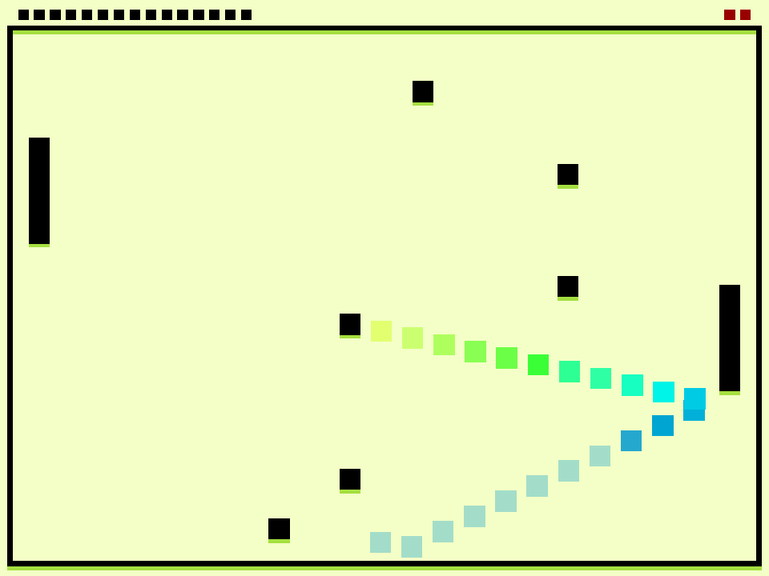

# Catch Pong!

Author: Yifei Li

Design: Based on Pong, but the Pong will split, and the player is supposed to "catch" cloned Pongs (without tail) and avoid being hit by mother Pong (with tail).

Screen Shot:

How To Play:

Control:

- Move mouse up & down to control play paddle.
- Press "Esc" to stop game; when stopped (or game over), press "Esc" to exit, or press "s" to restart.

Rules:

- The mother Pong (ball with rainbow tail) will SPLIT when hitting opposite panel OR hitting left/right wall for several times. Player needs to "catch" cloned Pongs (without tail) and avoid mother Pong.
- Number of caught Pongs displays on top-left (black box), while remaining life displays on top-right (red box).

Goals: catch as many cloned Pongs as possible.

This game was built with [NEST](NEST.md).
